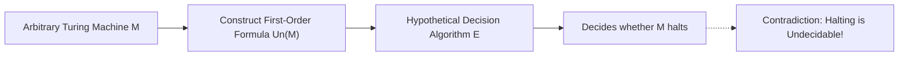

Every software engineer eventually hits a wall with static analysis. You write a linter rule, build an automated vulnerability scanner, or write a compiler pass, and you wonder: why can't a tool definitively tell me whether this loop terminates, whether this pointer ever dereferences null, or whether two arbitrary functions produce the same output? The answer was proved in 1936, before physical computers even existed.

> **The Core Takeaway:**
> In his landmark 1936 paper *"On Computable Numbers, with an Application to the Entscheidungsproblem"*, 24-year-old Alan Turing answered David Hilbert's decision problem with a definitive **NO**. To do so, he invented the mathematical blueprint for modern computers (the Universal Turing Machine), proved that the Halting Problem is undecidable via a fatal self-referential diagonal contradiction, and demonstrated that mathematical truth outstrips mechanical computation.

---

## 1. The Context: Hilbert's Dream of Total Automation

In 1928, mathematician David Hilbert challenged the mathematical world to resolve three foundational questions about formal axiomatic systems:

1. **Is mathematics complete?** Can every true statement be proved from axioms? (Answered **NO** by Kurt Gödel in 1931: any consistent system capable of arithmetic contains true statements that cannot be proven within the system).
2. **Is mathematics consistent?** Can we prove that the axioms never lead to a contradiction like \( 0 = 1 \)? (Answered **NO** by Gödel's Second Theorem: a system cannot prove its own consistency).
3. **Is mathematics decidable?** (*Das Entscheidungsproblem*, or The Decision Problem):
   > Is there an effective mechanical procedure (an algorithm) that takes any statement in first-order logic and decides, in a finite number of steps, whether it is universally valid?

Hilbert believed mathematics was fully mechanized. If the answer to the third question was yes, all mathematical inquiry could be handed over to a machine: feed in a conjecture (like the Riemann Hypothesis or Goldbach's Conjecture), crank the algorithmic handle, and receive a definitive True or False.

To disprove Hilbert, Turing had to first answer a question nobody had formalized: **what is an algorithm?**

---

## 2. Formalizing the "Computer": The a-Machine

In 1936, the word "computer" referred to a human clerk performing calculations on paper. Turing deconstructed what that human actually does down to physical primitives:

* A clerk works on paper: Turing abstracted this into an infinite 1-dimensional tape divided into discrete squares.
* A clerk can only inspect a limited number of symbols at one glance: Turing restricted the machine head to scanning **one square at a time**.
* A clerk has a finite number of distinct "states of mind": Turing defined a **finite set of internal states** \( Q = \{q_0, q_1, \dots, q_k\} \).
* A clerk moves between cells, alters symbols, and updates their train of thought based on rules: Turing formalized this as a finite transition function:
  $$\delta: (q_i, s_j) \longrightarrow (q_{new}, s_{write}, \text{Direction})$$

```text
       ... | Blank | 1 | 0 | 1 | 1 | 0 | Blank | ...  <-- Infinite Memory Tape
                         ^
                         | [ Read/Write Head ]
                    +---------+
                    | State q |   Transition Rule: (State q, Read 0) -> (Write 1, Move R, State q')
                    +---------+
```

Turing termed this an **a-machine (automatic machine)**. Despite having only four basic physical actions (read, write, move left/right, change state), this abstract construct can simulate any algorithm ever conceived.

Turing then classified real numbers:
* A real number in the interval \([0, 1]\) is **computable** if its digits can be printed sequentially on the tape by an a-machine.
* Machines that run indefinitely printing an infinite sequence of digits are called **circle-free**.
* Machines that halt, crash, or enter infinite loops without printing digits are called **circular**.

---

## 3. Code Is Data: Description Numbers & The Universal Machine

Because a machine's transition rules are finite, its complete specification can be written as a table of text.

1. **Standard Descriptions (S.D.):** Turing assigned a fixed character encoding to every state and transition.
2. **Description Numbers (D.N.):** By mapping characters to integers, every unique Turing machine compresses into a single, finite positive integer.

```text
Machine M  --->  Standard Description (S.D.)  --->  Unique Integer: D.N.(M)
```

This led to two groundbreaking breakthroughs:

### Consequence 1: Programs are Countable Integers
Because every Turing machine corresponds to a unique integer \( D.N. \in \mathbb{N} \), **the set of all possible computer programs is countably infinite**:
$$M_1, M_2, M_3, M_4, \dots$$

There are no more computer programs in existence than there are whole numbers.

### Consequence 2: The Universal Turing Machine (\(\mathcal{U}\))
If a program is just an integer, a machine can read another program as data.

Turing designed a single, specific machine, \(\mathcal{U}\), which accepts two inputs on its tape: the Description Number \( D.N.(M) \) of any arbitrary machine \( M \), and an input string \( x \). Machine \(\mathcal{U}\) reads the rules of \( M \) from the tape and simulates its execution step by step:
$$\mathcal{U}(D.N.(M), x) \equiv M(x)$$

This is the invention of the **stored-program computer**. Before Turing, hardware was built to do one task (a cash register added; a loom wove). Turing showed that a single physical piece of hardware could execute any arbitrary software program.

---

## 4. The Proof: Cantor's Diagonalization Applied to Machines

With the Universal Machine established, Turing addressed the core question: **can a machine determine whether another machine will run forever or stall?**

Today this is known as the **Halting Problem** (Turing formulated it as determining whether a machine is "circle-free"):

### The Hypothesis (Proof by Contradiction)
Assume there exists an algorithm: a Turing machine \(\mathcal{D}\) that can inspect any machine Description Number \( n \) and decide whether it is circle-free:
$$\mathcal{D}(n) = \begin{cases} 
\text{True} & \text{if machine } M_n \text{ will print digits forever (circle-free)} \\
\text{False} & \text{if machine } M_n \text{ halts, stalls, or loops without output (circular)}
\end{cases}$$

### Constructing the Machine \(\mathcal{H}\)
If \(\mathcal{D}\) exists, we can construct a new machine \(\mathcal{H}\) that generates a complete list of all computable real numbers:
1. Increment an integer \( n = 1, 2, 3, \dots \)
2. Run \(\mathcal{D}(n)\). If \(\mathcal{D}(n) = \text{False}\), discard \( n \).
3. If \(\mathcal{D}(n) = \text{True}\), invoke the Universal Machine \(\mathcal{U}\) to compute the digits of \( M_n \).

This creates an ordered, exhaustive matrix of all computable real numbers:

$$\begin{aligned}
M_1: &\quad 0.\mathbf{d_{1,1}} \; d_{1,2} \; d_{1,3} \; d_{1,4} \dots \\
M_2: &\quad 0.d_{2,1} \; \mathbf{d_{2,2}} \; d_{2,3} \; d_{2,4} \dots \\
M_3: &\quad 0.d_{3,1} \; d_{3,2} \; \mathbf{d_{3,3}} \; d_{3,4} \dots \\
M_4: &\quad 0.d_{4,1} \; d_{4,2} \; d_{4,3} \; \mathbf{d_{4,4}} \dots \\
\vdots
\end{aligned}$$

### The Diagonal Construction (\(\beta\))
Borrowing Georg Cantor's 1891 diagonal argument, Turing defines a new number \(\beta = 0.\beta_1 \beta_2 \beta_3 \dots\) by systematically inverting the diagonal elements:
$$\beta_k = 1 - d_{k,k}$$

If the \( k \)-th digit of machine \( M_k \) is \( 0 \), make \( \beta_k = 1 \). If it is \( 1 \), make \( \beta_k = 0 \).

```text
M1:  [0]  1   0   1 ...   ->  flip to 1
M2:   1  [1]  0   0 ...   ->  flip to 0
M3:   0   0  [0]  1 ...   ->  flip to 1
...
Beta: 1   0   1 ...
```

### The Fatal Contradiction
Now evaluate two questions about \(\beta\):

1. **Is \(\beta\) computable?**  
   Yes. We have an exact mechanical procedure to find every digit: to find digit \( k \), run \(\mathcal{H}\) to find the \( k \)-th circle-free machine, compute its \( k \)-th digit \( d_{k,k} \), and flip it (\( 1 - d_{k,k} \)). Because \(\beta\) is computable, it must be produced by some machine in our list: let us say machine \( M_m \).
2. **What is the \( m \)-th digit of \(\beta\)?**  
   * By definition of \(\beta\): \( \beta_m = 1 - d_{m,m} \).
   * But because \(\beta\) is the number computed by \( M_m \), its \( m \)-th digit must be: \( \beta_m = d_{m,m} \).

Equating the two:
$$d_{m,m} = 1 - d_{m,m} \implies 2 \cdot d_{m,m} = 1$$

No binary digit in \(\{0, 1\}\) can satisfy this equation.

The premise is false. **The decision machine \(\mathcal{D}\) cannot exist.**  
There is no general algorithm that can determine whether an arbitrary program will halt or run forever.

---

## 5. The Application: Destroying the Entscheidungsproblem

Having proved that the Halting Problem is uncomputable, Turing applied this result directly to Hilbert's *Entscheidungsproblem*.



1. **Encoding Execution in Logic:** For any Turing machine \( M \), Turing showed how to mechanically construct a single, finite formula in first-order predicate logic, denoted \( \text{Un}(M) \), that describes:
   * The initial blank tape configuration.
   * The legal transitions of \( M \).
   * The assertion: *"Machine \( M \) eventually prints the symbol 0."*
2. **The Logical Equivalence:** Turing proved:
   $$\text{Machine } M \text{ eventually prints 0} \iff \text{Formula } \text{Un}(M) \text{ is provable in first-order logic}$$
3. **The Conclusion:** If Hilbert's decision procedure existed, an algorithm could take \( \text{Un}(M) \) and decide its validity in finite time. But doing so would solve the Halting Problem, which was just proven mathematically impossible.

Therefore, **first-order logic is undecidable**. There is no algorithm that can determine the truth of all mathematical statements.

---

## 6. What This Means for Modern Software Engineering

Turing's 1936 paper is not ancient history: it draws the outer boundary of what every compiler, linter, and security analyzer can ever achieve:

* **Rice's Theorem (1953):** Any non-trivial semantic property of a program (e.g. *"does this function ever leak memory?"*, *"is this API route vulnerable to SQL injection?"*, *"does this routine return 403?"*) is undecidable.
* **Why Static Analysis Employs Approximations:** Linters and scanners cannot be simultaneously sound (no false negatives) and complete (no false positives). Every security tool is mathematically forced to make trade-offs: either flag benign code (false alarms) or miss real bugs (false sense of security).
* **Turing Completeness as an Attack Surface:** Whenever a configuration format (YAML, CSS, PDF font engines, BPF, smart contracts) accidentally becomes Turing complete, verifying its safety in advance becomes impossible.

Turing did not merely find a boundary in mathematics: by proving what algorithms cannot do, he built the first complete description of what all computers can do.
