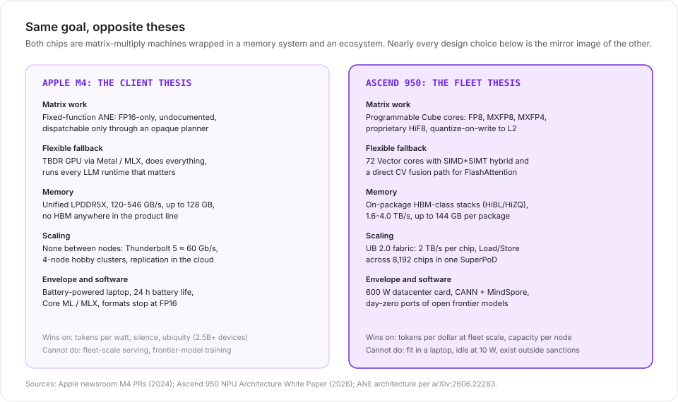
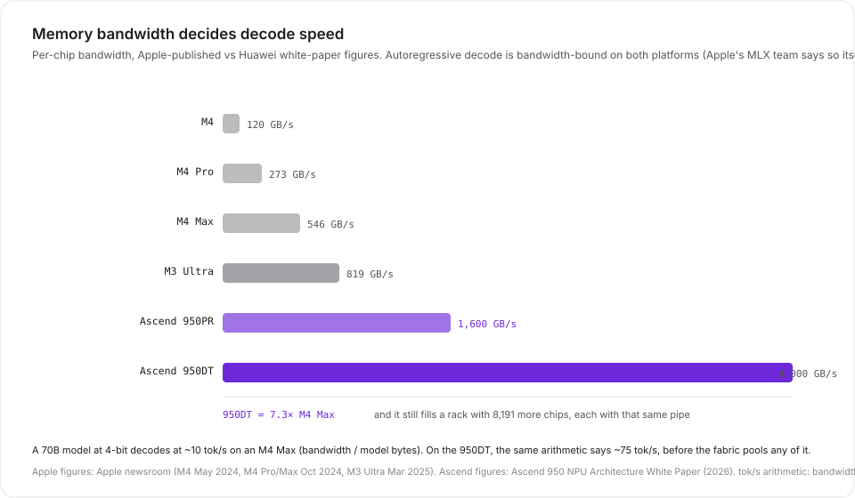

Last week's post took apart [Huawei's Ascend 950](), a datacenter accelerator built under export controls. The natural reaction was "but how does it compare to the chip in my laptop?" So: Apple's M4 family. Not because they compete, exactly. They don't, and that's the interesting part. One is the most sophisticated client SoC on the market; the other is a fleet component. Reading them against each other clarifies what "an AI chip" even means, because the two companies answered that question in almost perfectly opposite ways.

One scope note first: the M4 generation is a closed chapter. As of this week the Mac Studio ships with M5 Max and M5 Ultra (pre-orders open, delivery September 22), and there never was an M4 Ultra. Apple skipped straight past it. That fact will matter later.

---

## Two theses

Apple's thesis: **AI happens on the client, mostly in a fixed-function block, powered by a memory system shared with everything else.** Inference runs where the data and the user already are, because it's private, it's free at the margin, and it works on a battery. Apple's datacenter answer, [Private Cloud Compute](https://security.apple.com/blog/private-cloud-compute/), is not a GPU server product; it's custom Apple silicon behind a privacy architecture, and Apple refuses to say what's in it.

Huawei's thesis: **AI happens at fleet scale, in programmable engines, fed by dedicated memory, stitched into one fabric.** Every design decision serves tokens-per-dollar across a datacenter, under sanctions.

## The spec sheet, honestly

| | M4 | M4 Max | M3 Ultra | Ascend 950PR | Ascend 950DT |
|---|---|---|---|---|---|
| Product shape | iPad / MacBook | MacBook / Studio | Mac Studio | DC card | DC card |
| CPU | 4P+6E | 12P+4E | 20-24P+8E | Linx816 8C16T | Linx816 8C16T |
| Matrix engine | 16-core ANE | 16-core ANE | 32-core ANE | 32 Cube + 64 Vector | 36 Cube + 72 Vector |
| Peak matrix compute | 38 TOPS (Apple) | ~36 TFLOPS FP16 (est.) | ~2x M4 Max (est.) | 1,784 TFLOPS MXFP4 | 2,007 TFLOPS MXFP4 |
| Formats | FP16 (ANE), Metal GPU | FP16 (ANE) | FP16 (ANE) | FP8/HiF8/MXFP8/MXFP4 | same |
| Memory | 32 GB LPDDR5X | 128 GB LPDDR5X | up to 512 GB | 128 GB HiBL 1.0 | 144 GB HiZQ 2.0 |
| Bandwidth | 120 GB/s | 546 GB/s | 819 GB/s | 1.6 TB/s | 4.0 TB/s |
| Power | battery | battery / Studio | ~250 W load (measured) | ~600 W | ~600 W |
| Price | ~$1k device | from $1,999 (Studio) | $8,099-11,699 | ~$16k (reported) | n/a |
| Scaling beyond one | none | none | none (M4 skipped Ultra) | UB to 8,192 chips | same |

Sources: Apple newsroom PRs (May 7, 2024; Oct 30, 2024; Mar 5, 2025) and archived spec pages; Ascend 950 white paper (2026); TrendForce for the 950PR price. Some rows need immediate unpacking:

- **"38 TOPS" is Apple's only published AI number**, it belongs to the M4's Neural Engine, and it's an operations count at an unspecified precision (universally read as INT8). Apple publishes no FLOPS figures at all: not for the GPU, not for the ANE, not for any M-series chip, ever. The ~18 TFLOPS FP32 / ~36 TFLOPS FP16 figures floating around for the M4 Max's 40-core GPU are third-party derivations (core count x clock x FLOPs-per-core, e.g. flopper.io), not measurements. For calibration, NVIDIA quotes the RTX 4090 at 165.2 TFLOPS of dense FP16 tensor math; an RTX 4090 draws about the wall power of four MacBook Airs.
- **The Ascend's 2,007 TFLOPS is MXFP4**, a 4-bit tensor format with block scaling. Per-operation-per-watt, FP4 MACs are far cheaper than anything in the ANE. The 38 TOPS versus 2,007 TFLOPS gap is real, but it's a gap between different questions: INT8 ops in a phone SoC's power envelope versus FP4 tensor throughput in a 600 W card.
- **The M3 Ultra row is there because the M4 generation has no ultra part.** If you wanted a 512 GB Apple machine in 2025 and 2026, you bought the previous generation. That's a thesis signal, not an accident.

---

## What Apple actually built: a secret in two and a half billion devices

The Neural Engine has shipped in every Apple SoC since the A11 in 2017. It's now in over 2.5 billion active devices. And until June this year, almost nobody outside Cupertino could even tell you what it is, because Apple documents nothing about it: no ISA, no driver interface, no programming guide. Core ML treats it as an opaque scheduling hint. There was no documented way to prove a computation ran on it.

A [June 2026 Georgia Tech paper](https://arxiv.org/abs/2606.22283) changed that, by decompiling the private runtime, compiler, kernel driver, and firmware, then validating every claim against measurements on M1 and M5 silicon. What the ANE turns out to be:

- **A fixed-function FP16 matrix accelerator.** Each core is a 2D multiply tile backed by an 8-deep accumulator file, with an FP32-class accumulator per core. It is not a systolic array and not a small GPU; it's a fixed-geometry array fed by per-tile DMA engines.
- **Precision: FP16 compute, period.** The datapath has no BF16 and no FP32 mode; those annotations are accepted by the compiler frontend and silently cast down. FP8 has an e4m3 lane in the element-type table that appears gated off. INT8 and INT4 exist as **weight-streaming compression** (int4 is a 16-entry palette lookup), not compute lanes. On the M4 generation, int8 weights mostly just save storage.
- **~2 MB of on-chip SRAM** (M1) as the working set, interleaved across 64 banks. Past that, the engine tiles and streams from DRAM, which is exactly why decode-shaped workloads (streaming every weight for every token) cost it so much.
- **Clocks rose from ~1.4 GHz (M1) to ~2.36 GHz (M5)**, and int8 compute runs at up to 2x the FP16 rate on the same array.

Here's the part that should reframe how you think about the M4: **nobody runs LLMs on the ANE.** MLX and llama.cpp, the two runtimes that define Apple-silicon inference, both drive the **GPU** via Metal; MLX's supported devices are CPU and GPU, full stop. Apple's own 2023 engineering note on deploying transformers to the ANE is a dead link, and the academic measurement work shows why: the ANE accepts a restricted op set through an opaque planner, placement is decided op-by-op in ways that can silently strand a whole model on the CPU, and recompilation per step costs seconds. [Orion](https://arxiv.org/abs/2603.06728), bypassing Core ML through private APIs, got 170+ tok/s out of a tiny GPT-2 on an M4 Max, an impressive feat of plumbing that still proves the point: the ANE is where AI *marketing* lives, and the GPU is where AI *workloads* live.

> The ANE is best understood as Apple's bet on what inference would need in 2017, frozen into silicon: FP16 in, FP16 out, small models, fixed layers, maximum energy efficiency, zero developer surface. It's a bet that paid off for Siri-scale workloads and was quietly routed around for everything else.

Contrast the DaVinci v3 Cube Core: programmable datapaths with native FP8, MXFP8, MXFP4, and a proprietary FP8 variant (HiF8), on-the-fly quantization at write-back, layout transforms in hardware, and a direct fusion path into vector cores for FlashAttention. Huawei is chasing the same energy prize Apple chases with fixed function, but through **format flexibility** instead of silicon inflexibility. The MXFP4-4x-BF16 claim in the white paper is the same claim NVIDIA makes for Blackwell. The ANE has no answer to FP4, and architecturally can't: there's no mantissa-flexible datapath to teach.

---

## The numbers that actually matter: bandwidth and capacity

Both companies agree on the load-bearing fact, and Apple's own MLX team [confirmed it with measurements](https://machinelearning.apple.com/research/exploring-llms-mlx-m5): **autoregressive decode is memory-bandwidth-bound.** Tokens per second on a big model is roughly bandwidth divided by model bytes. This collapses the spec war into two numbers per chip:

| Workload | M4 Max (546 GB/s) | M3 Ultra (819 GB/s) | Ascend 950DT (4.0 TB/s) |
|---|---|---|---|
| Qwen3-8B 4-bit decode | ~90 tok/s (measured) | ~135 tok/s (arith.) | bandwidth not the limit |
| 70B Q4 decode | ~10 tok/s (arith.) | ~15 tok/s (arith.) | ~75 tok/s (arith.) |
| 600B+ model, 8-bit | doesn't fit | fits, ~30 tok/s (measured, 4-node cluster) | one chip holds it; fabric pools more |

(M4 Max measured number from the [apple-silicon-llm-bench](https://github.com/john-rocky/apple-silicon-llm-bench) harness, Qwen3-8B 4-bit, mean of 5 runs; 70B arithmetic is bandwidth / model-bytes and ignores overheads; the Ascend per-NPU serving numbers are Huawei's own [CloudMatrix-Infer paper](https://arxiv.org/abs/2506.12708) on the previous-generation hardware: 1,943 decode tok/s per NPU on DeepSeek-R1.)

The capacity dimension cuts the same way. 128 GB is the M4 Max ceiling, and it's gorgeous engineering, LPDDR5X at 546 GB/s inside a laptop. The Ascend 950DT puts 144 GB of HBM-class memory on one package and then does something the M4 generation structurally cannot: it lets 8,191 other packages read it.

## Scaling: a fabric versus a Thunderbolt cable

This is where the theses stop being mirror images and start being different species.

Apple's scaling story, honestly told: **there isn't one, and Apple doesn't sell one.** Within a package, two dies fuse through UltraFusion at 819 GB/s (M3 Ultra) and 1.2 TB/s (M5 Ultra). Between machines, you have Thunderbolt 5: ~120 Gb/s raw, about 50-60 Gb/s real per [Geerling's measurements](https://www.jeffgeerling.com/blog/2025/15-tb-vram-on-mac-studio-rdma-over-thunderbolt-5), no switches exist, so you cross-link machines point to point. His four-Studio cluster (1.5 TB of pooled memory, ~$40k) runs Kimi K2 Thinking, a trillion-parameter model, at ~30 tok/s using [exo](https://github.com/exo-explore/exo) with RDMA over Thunderbolt 5. It's a genuinely impressive engineering result, and it is the *ceiling* of Mac scale: four nodes, hobby budget, and the inter-node link is two orders of magnitude below the Ascend's per-chip UB bandwidth.

Huawei's story: UB 2.0 gives every chip a 2 TB/s bidirectional pipe into a coherent Load/Store domain of up to 8,192 chips, with hardware collectives and IO dies that forward transit traffic without touching compute. It's the exact architecture you'd design if your unit of competition were "tokens per day for a nation's inference fleet", which, given DeepSeek's 160,000-chip order, it is.

Apple's datacenter answer is different in kind: [Private Cloud Compute](https://security.apple.com/blog/private-cloud-compute/), custom Apple silicon in hardened, stateless, publicly-auditable nodes, scaled by **replication** behind a load balancer rather than by coupling. Apple has never published a node spec, and the PCC design implies they consider tight coupling a liability (it is, for their threat model: stateless nodes can't leak what they never held). Huawei scales *out* with a fabric; Apple scales *out* with copies; NVIDIA scales *up and out* with NVLink domains.

## Power and efficiency: where the thesis earns its keep

The M4's stack is absurdly efficient at small-scale inference, and the ANE is the reason even though the ANE usually isn't the thing running the model. The Georgia Tech measurements put the ANE at a 1.8x energy advantage over the GPU on attention workloads, a ~0.9 W dispatch floor, and about 4-6 W under full compute load. Apple's own on-device foundation model (3B parameters, quantized to 3.7 bits per weight) does 30 tok/s on an iPhone. MacBook Pro claims "up to 24 hours" of battery life, and LLM inference happens inside that envelope without a power cord in sight.

The Ascend 950PR is a 600 W card. Per-NPU decode in Huawei's own paper is 1,943 tok/s on R1 at under 50 ms TPOT, which is excellent tokens-per-rack-unit, and their published training MFU on the previous generation (34.9%) trails NVIDIA's typical 50-55%. Nobody buys an Ascend because it sips power; they buy it because it exists, it's in stock (allocation-gated, but in stock), and it answers to no export license.

The honest symmetry: **Apple wins tokens per watt and tokens per silence; Huawei wins tokens per dollar at fleet scale and tokens per rack under embargo.** The M4 Max at ~65 W in a Studio (Apple publishes only the machine's 480 W maximum continuous rating, not chip power) versus a 600 W Ascend card is not an Apple humiliation; it's a different denominator.

## What each can't do

**The M4 cannot scale.** No fabric, no inter-node standard, no datacenter product you can buy, no FP8 or BF16 in its dedicated matrix engine, a 128 GB ceiling, and a matrix block that can't be taught new formats. If your model outgrows one package, Apple's answer is "buy another laptop", or "wait for PCC", or "that's not our market". The skipped M4 Ultra suggests even Apple sees the fused-die path as an M5-generation question.

**The Ascend 950 cannot be personal.** 600 W cards don't run on battery, the software stack (CANN, ~80-90% operator coverage) is a decade behind CUDA's gravity, the MFU gap is real, and the whole thing exists inside a sanctions wall that keeps getting rebuilt. It is also, conspicuously, not for sale to you.

---

## Two theories of the AI chip

It's tempting to score this as a fight and declare NVIDIA the referee. That misses the shift. The market is bifurcating along exactly the line these two chips sit on: [Benedict Evans frames token pricing as a market where](https://www.ben-evans.com/benedictevans/2026/7/9/ways-to-think-about-token-pricing) some use cases work "just fine with a small, old, perhaps open source model that runs for 'free' on your phone", while others pay frontier datacenter rates. Apple built the chip for the first sentence. Huawei built the chip for the second. NVIDIA built a family for both and priced it accordingly.

The M4 is the most refined expression of the client thesis: a GPU that renders and infers, a fixed-function block for the predictable parts, memory shared with the OS, all of it invisible. The Ascend 950 is the rawest expression of the fleet thesis: formats, fabric, capacity, and volume production under embargo. One optimizes joules; the other optimizes sanctions.

Which one "wins" is the wrong question. The right one: for your workload, is the bottleneck energy and privacy (then it's an M-series-shaped problem), or is it capacity and throughput at fleet scale (then it's a fabric-shaped problem)? The chips stopped pretending to be interchangeable years ago. It's the marketing that hasn't caught up.

---

## Sources

**Apple (primary):** [M4 PR](https://www.apple.com/newsroom/2024/05/apple-introduces-m4-chip/) (May 2024) and [M4 Pro/Max PR](https://www.apple.com/newsroom/2024/10/apple-introduces-m4-pro-and-m4-max/) (Oct 2024): core counts, bandwidth, 38 TOPS, N3E node. [Mac Studio PR](https://web.archive.org/web/20250305140354/https://www.apple.com/newsroom/2025/03/apple-unveils-new-mac-studio-the-most-powerful-mac-ever/) (Mar 2025): M3 Ultra, 819 GB/s, 600B-parameter claim. [Private Cloud Compute](https://security.apple.com/blog/private-cloud-compute/) (Jun 2024). [Apple foundation models](https://machinelearning.apple.com/research/introducing-apple-foundation-models) (Jun 2024). [MLX on M5](https://machinelearning.apple.com/research/exploring-llms-mlx-m5) (Nov 2025): decode is bandwidth-bound.

**ANE reverse engineering:** [arXiv:2606.22283](https://arxiv.org/abs/2606.22283) (architecture), [arXiv:2606.17090](https://arxiv.org/abs/2606.17090) (ANEForge), [arXiv:2603.06728](https://arxiv.org/abs/2603.06728) (Orion, M4 Max), [arXiv:2608.22110](https://arxiv.org/abs/2608.22110) (placement study).

**Measurements:** [apple-silicon-llm-bench](https://github.com/john-rocky/apple-silicon-llm-bench) (M4 Max tok/s), [Jeff Geerling's 4-node cluster](https://www.jeffgeerling.com/blog/2025/15-tb-vram-on-mac-studio-rdma-over-thunderbolt-5) (Dec 2025), [exo](https://github.com/exo-explore/exo), [MLX](https://github.com/ml-explore/mlx).

**Huawei side:** all specs from the [Ascend 950 white paper](https://public-download.obs.cn-east-2.myhuaweicloud.com/ascend/%E6%98%87%E8%85%BE950%20NPU%E6%9E%B6%E6%9E%84%E7%99%BD%E7%9A%AE%E4%B9%A6.pdf) and [the previous post](); 950PR pricing via [Spheron/TrendForce reporting](https://www.spheron.network/blog/huawei-ascend-950-vs-nvidia-b300-b200-llm-inference-2026/); per-NPU serving numbers from [CloudMatrix-Infer](https://arxiv.org/abs/2506.12708).

*Estimates are labeled in-line (GPU TFLOPS derivations, 70B tok/s arithmetic). Apple publishes no FLOPS, clocks, TDP, or die sizes for any M-series chip; if you see those stated as fact anywhere, they're derived.*
